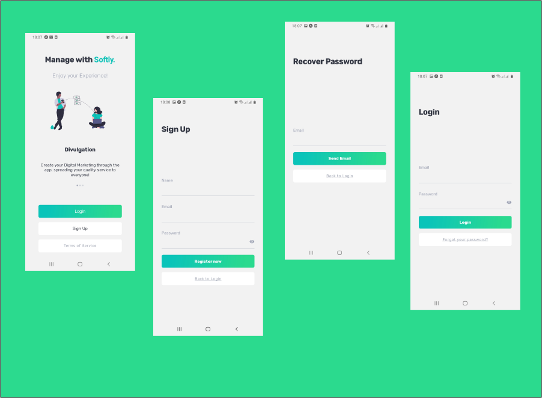

# Softly Screens - FrontEnd UI/UX

## Welcome! 👋

Thanks for checking out this front-end coding challenge.

## Building your project

1. Clone the repository to your computer.
2. Install all the dependency, using Yarn.
3. Just start the project now, let's go use "Expo Start"!

## Qualities

The intuition of coding this "application" is to make it easier for beginners in programming.

- Easy
- Beautiful
- Minimalist
- Organized
